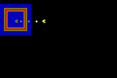
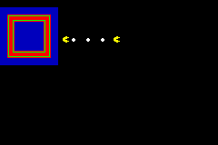

Alphablend Test
===============

This test just shows how alphablend can be used with LibGBA-CPP.

| Function      | Status  |
|---------------|---------|
| Alphablend    | Working |
| Brighten      | Working |
| Lighten       | Working |

Explanation
-----------

_TODO._

Screenshots
-----------

