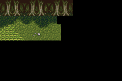

Generated Tilemaps
==================

Actually used to test if [my map editor](https://github.com/jptiz/map-editor)
is generating maps properly compatible with LibGBA-CPP.

| Function        | Status       |
|-----------------|--------------|
| Single Layer    | Working      |
| Multiple Layers | Working      |
| Link Tileset    | Working      |

Explanation
-----------

_TODO._

Screenshots
-----------

