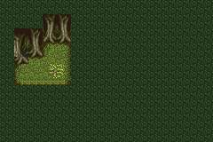

Tilemaps
========

Tests if:
- Maps are displayed properly according to its layers and tileset;
- Map loading is copying tilemap/tileset data correctly to VRAM;
- Tile-map and Tile-data base-blocks are properly calculated.

| Function        | Status       |
|-----------------|--------------|
| Single Layer    | Working      |
| Multiple Layers | Working      |
| Tileset         | Working      |
| Load Tilemap    | Working      |
| Layer Priority  | Working      |
| Map Switching   | **Untested** |
| 8x8 Tiles       | Working      |
| 256-Color Tiles | **Untested** |

Explanation
-----------

_TODO._

Screenshots
-----------

