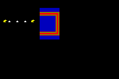

Windowing
=========

Tests if Window-Clip systems are working correctly.

| Function          | Status       |
|-------------------|--------------|
| BG Layer Clipping | Working      |
| Object Clipping   | **Untested** |

Explanation
-----------

_TODO._

Screenshots
-----------

It can be seen that the layer containing two Pacmans and three dots is clipped
in bottom (as Window1 is On for BG1 with `bottom = 45`), while the layer
containing a red and green square above a blue square is clipped in left and
right (as Window0 is On for BG0 with `left = 80` and `right = 120`).

